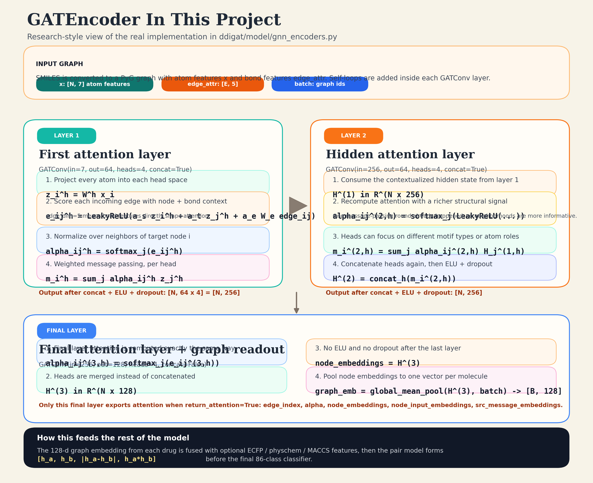

# GATEncoder Layer-by-Layer Visualization

This note explains the exact `GATEncoder` used by the project and matches the figure in `docs/assets/gat_encoder_research.svg`.



## What the encoder receives

- Molecular graph construction happens in `ddigat/data/featurize.py`.
- Each atom becomes a 7-d feature vector.
- Each directed bond becomes a 5-d edge feature vector.
- The encoder receives `x`, `edge_index`, `edge_attr`, and `batch`.

Reference:
- `smiles_to_pyg()` in `ddigat/data/featurize.py`

## Layer 1

From `ddigat/model/gnn_encoders.py`, layer 1 is:

```text
GATConv(in_channels=7, out_channels=64, heads=4, concat=True, edge_dim=5)
```

Conceptually:

```text
z_i^h = W^h x_i
e_ij^h = LeakyReLU(a_s z_i^h + a_t z_j^h + a_e W_e edge_ij)
alpha_ij^h = softmax_j(e_ij^h)
m_i^h = sum_j alpha_ij^h z_j^h
H_i^(1) = concat_h(m_i^h)
```

What matters:

- `softmax_j` means all incoming neighbors of target node `i` compete for attention mass.
- `edge_dim=5` means bond attributes directly influence the attention score.
- Because `concat=True`, the output width is `64 * 4 = 256`.
- After this layer, the code applies `ELU` and `dropout`.

## Layer 2

Layer 2 is:

```text
GATConv(in_channels=256, out_channels=64, heads=4, concat=True, edge_dim=5)
```

This repeats the same attention mechanism, but on already contextualized hidden states.

What changes:

- Input is now `H^(1)` instead of raw atom features.
- Heads can specialize on more global structural motifs because one round of message passing already happened.
- Output stays `256` dims because heads are concatenated again.
- The code again applies `ELU` and `dropout`.

## Final layer

The last encoder layer is:

```text
GATConv(in_channels=256, out_channels=128, heads=4, concat=False, edge_dim=5)
```

This is the important research-facing detail:

- Attention is still multi-head.
- But `concat=False` means the layer returns `128` dims, not `128 * 4`.
- The final output is the node embedding matrix used for graph pooling.
- The code does not apply `ELU` or `dropout` after this final layer.

The encoder then does:

```text
graph_emb = global_mean_pool(node_embeddings, batch)
```

So each molecule becomes one `128`-d graph embedding.

## Where softmax and attention are exposed

Attention is exported only for the final GAT layer when `return_attention=True`.

The encoder stores:

- `edge_index`
- `alpha`
- `batch`
- `node_embeddings`
- `node_input_embeddings`
- `src_message_embeddings`

That is why the repo explanation pipeline visualizes final-layer attention, not attention from every intermediate layer.

## Why this matters for the whole DDI model

The `DDIPairModel` encodes drug A and drug B with the same shared `GATEncoder`, then builds:

```text
[h_a, h_b, |h_a - h_b|, h_a * h_b]
```

That 4-way interaction vector is what the classifier uses for the final 86-class prediction.

## Exact code map

- `ddigat/model/gnn_encoders.py`
- `ddigat/model/pair_model.py`
- `ddigat/explain/attention.py`
- `ddigat/data/featurize.py`
